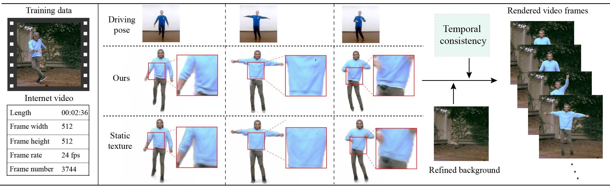

I am Yang-Tian Sun, a master student graduated from [Institute of Computing Technology, Chinese Academy of Sciences](http://english.ict.cas.cn), supervised by Prof. [Lin Gao](http://www.geometrylearning.com). My current research interests include neural rendering and 3D computer vision. I have received the bachelor's degree of science from [University of Science and Technology Beijing](https://en.ustb.edu.cn/) at 2019.

Work experience
======
* **Tencent AI Lab, Shenzhen, China, (Jun 2020 - Mar 2021)**
	* Research Intern
	* Digital Human Generation

* **Alibaba Taobao, Hangzhou, China, (Jun 2021 - Oct 2021)**
	* Research Intern
	* Neural Radiance Field

* **NetEase Game AI Lab, Hangzhou, China, (June 2022 - Now)**
	* AI Engineer
	* Neural Rendering

Publications
======
* **[NeRF-Editing: Geometry Editing of Neural Radiance Fields](http://geometrylearning.com/NeRFEditing/)**
	* {Yu-Jie Yuan\*, **Yang-Tian Sun\***}, Yu-Kun Lai, Yuewen Ma, Rongfei Jia, Lin Gao
	* IEEE Conference on Computer Vision and Pattern Recognition(**CVPR**), 2022

<!-- * **[Robust Pose Transfer with Dynamic Details using Neural Video Rendering](https://arxiv.org/abs/2106.14132)**
	* **Yang-Tian Sun**, Hao-Zhi Huang, Xuan Wang, Yu-Kun Lai, Wei Liu, Lin Gao
	* IEEE Transactions on Pattern Analysis and Machine Intelligence(**TPAMI**), 2022 -->

* **[Human Motion Transfer with 3D Constraints and Detail Enhancement](https://arxiv.org/abs/2003.13510)**
	* **Yang-Tian Sun**, Qian-Cheng Fu, Yue-Ren Jiang, Zitao Liu, Yu-Kun Lai, Hongbo Fu, Lin Gao
	* IEEE Transactions on Pattern Analysis and Machine Intelligence(**TPAMI**), 2022

**[Robust Pose Transfer with Dynamic Details using Neural Video Rendering](https://arxiv.org/abs/2106.14132)**

**Yang-Tian Sun**, Hao-Zhi Huang, Xuan Wang, Yu-Kun Lai, Wei Liu, Lin Gao

IEEE Transactions on Pattern Analysis and Machine Intelligence(**TPAMI**), 2022

Professional Services
======
To be completed

